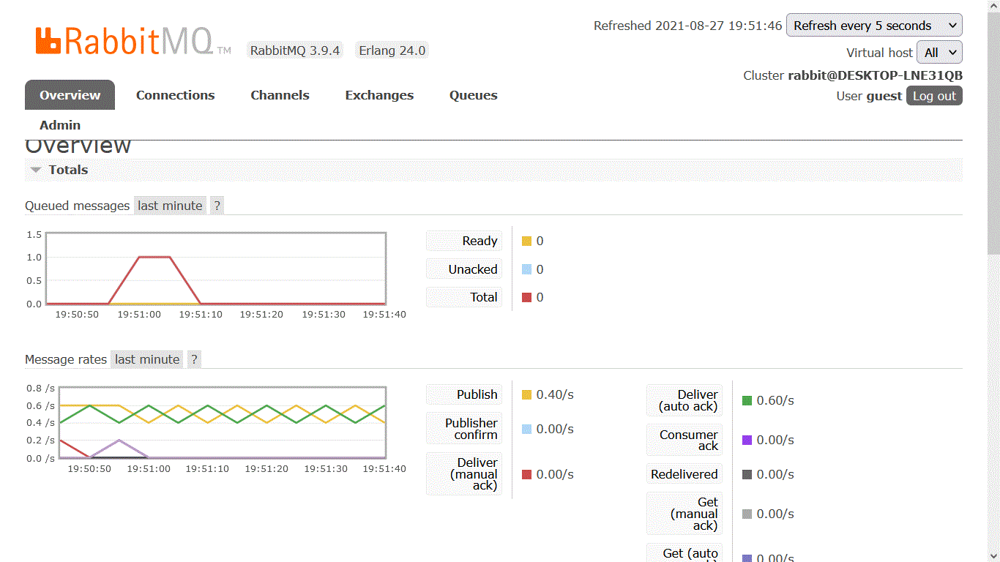
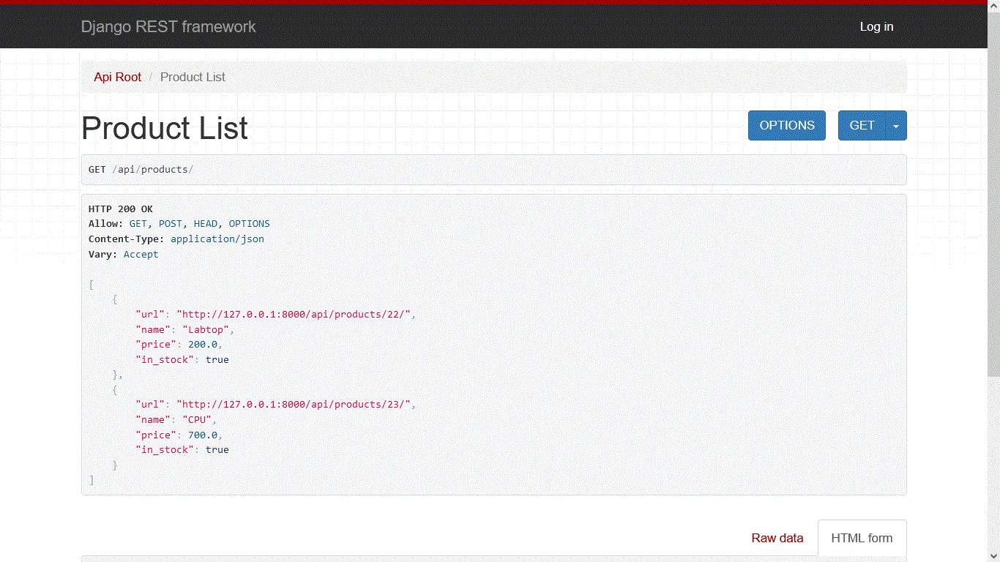
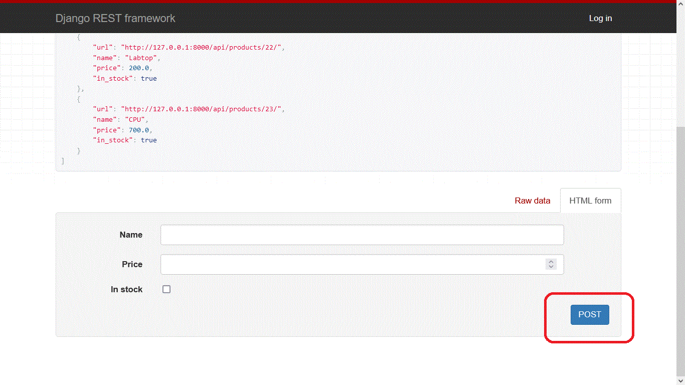
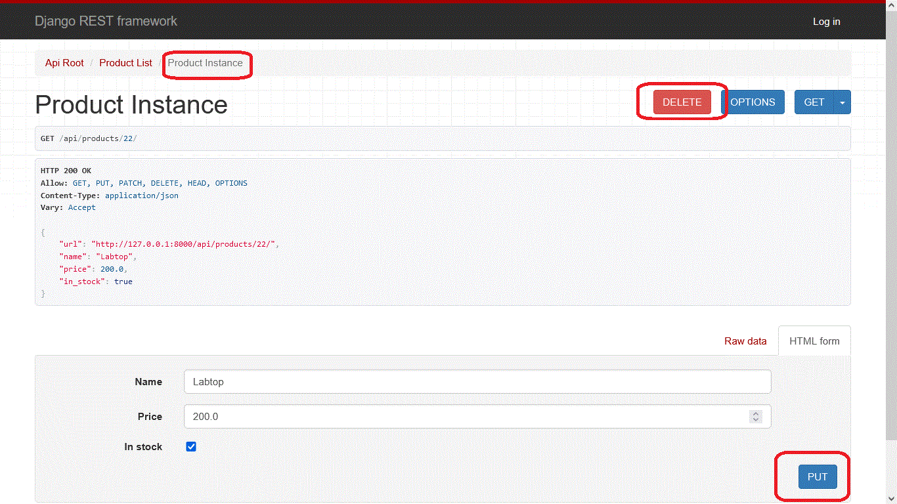

# rabbitmq_celery_project
A project using Celery, RabbitMQ with Django





# A) How to run:

You need to open 2 bash command line tabs:

## A-1) First Bash Tab:

<b>

```bash
pip instal -r requirements.txt
cd _app
python manage.py makemigrations
python manage.py migrate
python manage.py runserver
```
</b>
These command will run the django app.


## A-2) Second Bash Tab:


<b>

```bash
celery -A _app worker -l info 
```
</b>

For Windows users (Like me), run this command instead:
<b>

```bash
celery -A _app worker --pool=solo -l info
```
</b>
These comammnds will run the celery consumer.


# B) Endpoints:

## B-1) `api/products/` (GET):

<table>
<tr>
	<th>Functionality</th>
	<th>Communication Method</th>
</tr>
<tr>
	<td>Get a list of products</td>
	<td>Immediately connect to database to get the response</td>
</tr>
</table>




## B-2) `api/products/` (POST):

<table>
<tr>
	<th>Functionality</th>
	<th>Communication Method</th>
</tr>
<tr>
	<td>Add a New Product</td>
	<td>Queued</td>
</tr>
</table>





## B-3) `api/products/<int:id>` (GET):

<table>
<tr>
	<th>Functionality</th>
	<th>Communication Method</th>
</tr>
<tr>
	<td>Get details of a specific product</td>
	<td>Immediately connect to database to get the response</td>
</tr>
</table>


## B-4) `api/products/<int:id>` (PUT):

<table>
<tr>
	<th>Functionality</th>
	<th>Communication Method</th>
</tr>
<tr>
	<td>Update an existing product</td>
	<td>Queued</td>
</tr>
</table>


## B-5) `api/products/<int:id>` (DELETE):


<table>
<tr>
	<th>Functionality</th>
	<th>Communication Method</th>
</tr>
<tr>
	<td>Delete an existing product</td>
	<td>Queued</td>
</tr>
</table>





